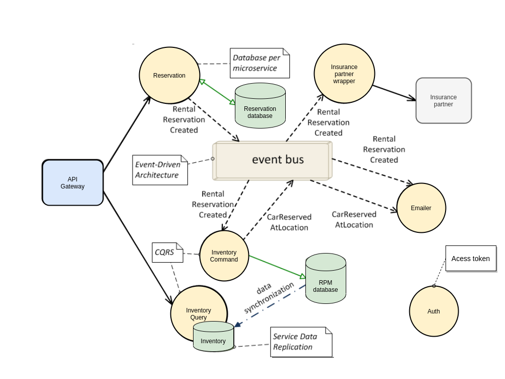

This is the Kotlin version to search for rental cars and make reservations, example that I've used to presentation
on developing microservices.

This application demonstrates the patterns:

* [Event-driven](https://microservices.io/patterns/data/event-driven-architecture.html) - some business transactions, however, span multiple service so you need a mechanism to ensure data consistency across services.
* [Database per service](https://microservices.io/patterns/data/database-per-service.html) - each service has its own private database.
* [CQRS](http://microservices.io/patterns/data/cqrs.html) - implement queries by maintaining one or more materialized views that can be efficiently queried.
* [Event sourcing](https://microservices.io/patterns/data/event-sourcing.html) - persist aggregates as a sequence of events.
* [Shared database](https://microservices.io/patterns/data/shared-database.html) - services share a database.
* [API gateway](https://microservices.io/patterns/apigateway.html) - a service that provides each client with unified interface to services.
* [Circuit Breaker](https://microservices.io/patterns/reliability/circuit-breaker.html) - invoke a remote service via a proxy that fails immediately when the failure rate of the remote call exceeds a threshold.
* [Access Token](https://microservices.io/patterns/security/access-token.html) - a token that securely stores information about user that is exchanged between services.
* [Distributed tracing](https://microservices.io/patterns/observability/distributed-tracing.html) - instrument services with code that assigns each external request an unique identifier that is passed between services. Record information (e.g. start time, end time) about the work (e.g. service requests) performed when handling the external request in a centralized service.
* [Health check API](https://microservices.io/patterns/observability/health-check-api.html) - service API (e.g. HTTP endpoint) that returns the health of the service and can be pinged, for example, by a monitoring service.

## Architecture

The following diagram shows the architecture of the Rental Cars application.

The application consists in the services: `API Gateway`, `Auth Service`, `Reservation Service`, `Inventory Command Service`, `Inventory Query Service`, `Emailer Service`, and `Insurance Partner Wrapper Service`.

All services implemented using:

* [Spring Boot](https://spring.io/projects/spring-boot) - makes it easy to create stand-alone, production-grade Spring based Applications that you can "just run".
* [Spring Data JPA](https://spring.io/projects/spring-data-jpa) - makes it easy to easily implement JPA based repositories.
* [Spring Security (OAuth2)](https://spring.io/projects/spring-security-oauth) - is a powerful and highly customizable authentication and access-control framework. 
* [Spring Retry](https://docs.spring.io/spring-batch/docs/current/reference/html/retry.html) - to make processing more robust and less prone to failure, it sometimes helps to automatically retry a failed operation in case it might succeed on a subsequent attempt.
* [Spring Cache](https://docs.spring.io/spring/docs/4.1.x/spring-framework-reference/html/cache.html) - provides support for transparently adding caching into an existing Spring application.
* [Spring Cloud Netflix](https://spring.io/projects/spring-cloud-netflix):
    * Routing (Zuul) - provide a simple, yet effective way to route to APIs and provide cross cutting concerns to them such as: security, monitoring/metrics, and resiliency.
    * Discovery (Eureka) - instances can be registered and clients can discover the instances using Spring-managed beans.
    * Circuit Breaker (Hystrix) - provide a consistent API to use in your applications allowing you the developer to choose the circuit breaker implementation that best fits your needs for your app.
* [Spring Cloud Tracing (Sleuth)](https://spring.io/projects/spring-cloud-sleuth) - implements a distributed tracing solution for Spring Cloud, borrowing heavily from Dapper, Zipkin and HTrace.
* [Spring Cloud Stream (Kafka)](https://spring.io/projects/spring-cloud-stream) - is a framework for building highly scalable event-driven microservices connected with shared messaging systems.
* [Axon Framework](https://axoniq.io/resources/concepts#0) - platform has roots in the well established CQRS (Command Query Responsibility Segregation) and Event Sourcing design patterns as well as the DDD (Domain-Driven Design) architecture paradigm.